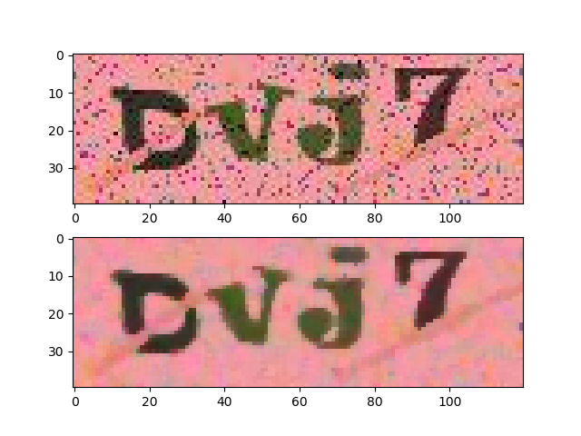
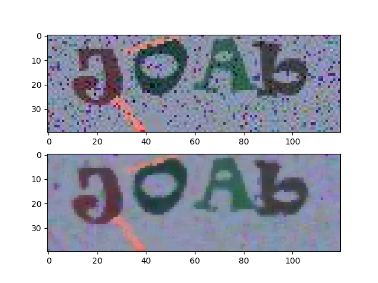
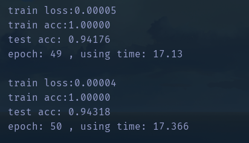
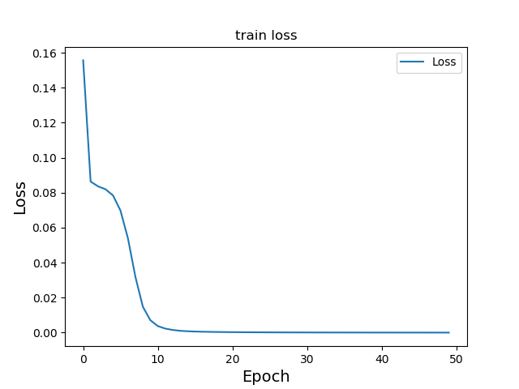
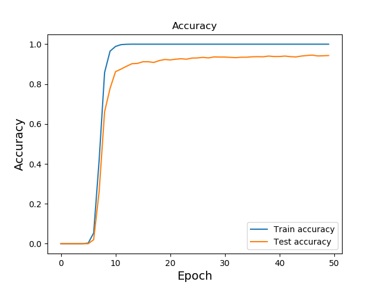

# Captcha
基于pyorch CNN的验证码识别，
在测试集上约可达到93%~94%的正确率

**Add jupyter notebook. train.ipynb**

## Environment
|Packege|Version|
|---|---|
|Pillow|6.0.0|
|torch|1.4.0 + cu92|
|torchvision|0.5.0+cu92|
|pandas|1.0.1|
|numpy|1.18.1|
|scikit-klearn|0.22.2|

## Argument
- max_epoch = 50
- eps = 1e-5
- batch_size = 128
- base_lr = 0.001


## File Structure
```
Captcha
    ├─datasets.py
    ├─Dockerfile
    ├─model.py
    ├─README.md
    ├─requirements.txt
    ├─train.py
    ├─conprison.py
    ├─train.ipynb
    |
    ├─checkpoints
    │      └─model.pth
    │
    ├─result
    └─data
        │ label.csv
        │
        └─train
            │ 1.jpg
            │ 2.jpg
            ...
            └─ 5000.jpg
```

## Data
本项目采用全国高校计算机能力挑战赛所提供数据集，共5000张验证码图片，存于data下的train文件夹之中，图片随机包含大小写字母、数字的四位字符。

data文件夹下的label.csv存有将图片名称与图片上正确标签相对应的csv文件。


本项目将数据集划分为70%训练集，30%测试集。

```python 
# train.py
def train_test_split(df, test_size=0.3, shuffle=False, random_state=None):
    if shuffle:
        df = reset(df, random_state=random_state)
    traindf = df[int(len(df) * test_size):]
    testdf = df[:int(len(df) * test_size)]
    return traindf, testdf
```

## Image loading and filtering
先划分测试集与训练集，再根据训练集（测试集）表中所拥有的图片名称加载相应图片。并对图片进行one-hot编码。

验证码图片中存在有许多噪点，
因此采用中值滤波对图片去噪，然后使用边界增强滤波，加强对图片的边缘进行增强。
```python
#data.py
def img_loader(img_path):
    img = Image.open(img_path).convert('RGB')
    plt.subplot(311)
    plt.imshow(img)

    img = img.filter(ImageFilter.MedianFilter(size=3))
    plt.subplot(312)
    plt.imshow(img)

    plt.show()
    return img
```
滤波前后对比：


上方图片为原图片，下方图片为中值滤波后。


## Model
使用pytorch 构建四层网络，输入通道设定为3，输出通道512，激活函数使用LeakyReLU。
详见 model.py

模型结果保存于checkpoints。


## Result
- 在经过25次左右的训练后，就可以达到约93%的精确度，经50次训练后约有94%的精确度
    
- 损失函数变化：

    
    
- 精确度变化：

    


